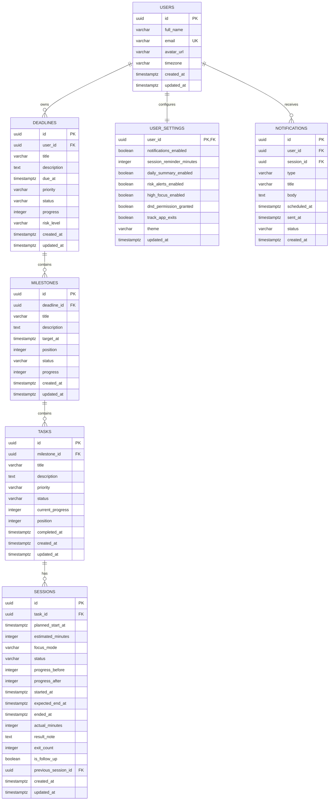

# OnTrack — Database ERD & Data Model

## 1. Mục tiêu

Thiết kế database cho OnTrack theo mô hình:

```text
User
└── Deadline
    └── Milestone
        └── Task
            └── Session
```

Nguyên tắc chính:

- Task là công việc thực tế cần đạt 100%.
- Session là một lần thực hiện Task.
- Progress được cập nhật từ Session lên Task.
- Milestone progress được tính từ các Task.
- Deadline progress được tính từ các Milestone.
- Người dùng không chỉnh trực tiếp progress của Deadline hoặc Milestone.

---

## 2. ERD tổng quát



---

## 3. Bảng `users`

Nếu dùng Supabase Auth, thông tin đăng nhập nằm trong `auth.users`.

Bảng `profiles` có thể thay cho `users` trong public schema.

### Columns

| Field | Type | Rule |
|---|---|---|
| id | UUID | PK, tham chiếu auth user |
| full_name | VARCHAR(100) | Required |
| email | VARCHAR(255) | Unique |
| avatar_url | TEXT | Nullable |
| timezone | VARCHAR(50) | Default `Asia/Ho_Chi_Minh` |
| created_at | TIMESTAMPTZ | Default now |
| updated_at | TIMESTAMPTZ | Default now |

---

## 4. Bảng `deadlines`

### Columns

| Field | Type | Rule |
|---|---|---|
| id | UUID | PK |
| user_id | UUID | FK → users.id |
| title | VARCHAR(150) | Required |
| description | TEXT | Nullable |
| due_at | TIMESTAMPTZ | Required |
| priority | ENUM | LOW, MEDIUM, HIGH |
| status | ENUM | PLANNING, IN_PROGRESS, AT_RISK, COMPLETED, OVERDUE |
| progress | SMALLINT | 0–100, derived |
| risk_level | ENUM | ON_TRACK, AT_RISK, OVERDUE |
| created_at | TIMESTAMPTZ | Default now |
| updated_at | TIMESTAMPTZ | Default now |

### Rules

```text
due_at > created_at
0 <= progress <= 100
```

Deadline progress không được chỉnh trực tiếp từ UI.

---

## 5. Bảng `milestones`

### Columns

| Field | Type | Rule |
|---|---|---|
| id | UUID | PK |
| deadline_id | UUID | FK → deadlines.id |
| title | VARCHAR(150) | Required |
| description | TEXT | Nullable |
| target_at | TIMESTAMPTZ | Required |
| position | INTEGER | Default 0 |
| status | ENUM | NOT_STARTED, IN_PROGRESS, COMPLETED, OVERDUE |
| progress | SMALLINT | 0–100, derived |
| created_at | TIMESTAMPTZ | Default now |
| updated_at | TIMESTAMPTZ | Default now |

### Rules

```text
target_at <= deadline.due_at
0 <= progress <= 100
```

---

## 6. Bảng `tasks`

### Columns

| Field | Type | Rule |
|---|---|---|
| id | UUID | PK |
| milestone_id | UUID | FK → milestones.id |
| title | VARCHAR(150) | Required |
| description | TEXT | Nullable |
| priority | ENUM | LOW, MEDIUM, HIGH |
| status | ENUM | NOT_STARTED, IN_PROGRESS, COMPLETED, CANCELLED |
| current_progress | SMALLINT | Default 0 |
| position | INTEGER | Default 0 |
| completed_at | TIMESTAMPTZ | Nullable |
| created_at | TIMESTAMPTZ | Default now |
| updated_at | TIMESTAMPTZ | Default now |

### Rules

```text
0 <= current_progress <= 100
```

State mapping:

```text
0%        → NOT_STARTED
1–99%     → IN_PROGRESS
100%      → COMPLETED
```

---

## 7. Bảng `sessions`

Đây là bảng quan trọng nhất của OnTrack.

### Columns

| Field | Type | Rule |
|---|---|---|
| id | UUID | PK |
| task_id | UUID | FK → tasks.id |
| planned_start_at | TIMESTAMPTZ | Required |
| estimated_minutes | INTEGER | > 0 |
| focus_mode | ENUM | NORMAL, HIGH |
| status | ENUM | PLANNED, IN_PROGRESS, PAUSED, COMPLETED, ENDED_EARLY, SKIPPED, CANCELLED |
| progress_before | SMALLINT | 0–100 |
| progress_after | SMALLINT | Nullable until review |
| started_at | TIMESTAMPTZ | Nullable |
| expected_end_at | TIMESTAMPTZ | Nullable |
| ended_at | TIMESTAMPTZ | Nullable |
| actual_minutes | INTEGER | Nullable |
| result_note | TEXT | Nullable |
| exit_count | INTEGER | Default 0 |
| is_follow_up | BOOLEAN | Default false |
| previous_session_id | UUID | Nullable FK → sessions.id |
| created_at | TIMESTAMPTZ | Default now |
| updated_at | TIMESTAMPTZ | Default now |

### Rules

```text
estimated_minutes > 0
0 <= progress_before <= 100
progress_after IS NULL OR progress_after >= progress_before
progress_after IS NULL OR progress_after <= 100
```

### Session start

Khi bắt đầu:

```text
status = IN_PROGRESS
started_at = now()
expected_end_at = started_at + estimated_minutes
progress_before = task.current_progress
```

### Session end

Khi kết thúc:

```text
ended_at = now()
actual_minutes = ended_at - started_at
```

Sau đó người dùng phải review trước khi Task progress được cập nhật.

---

## 8. Follow-up Session

Một follow-up Session vẫn thuộc cùng Task.

```text
is_follow_up = true
previous_session_id = previous session id
progress_before = task.current_progress
```

Ví dụ:

```text
Session 1: 0 → 40
Session 2: 40 → 75
Session 3: 75 → 100
```

Không tạo Task mới.

Không cho tạo follow-up nếu Task đã đạt 100%.

---

## 9. Progress Calculation

## 9.1 Task

```text
task.current_progress = session.progress_after
```

Chỉ cập nhật sau khi Post-Session Review được lưu.

## 9.2 Milestone

MVP:

```text
milestone.progress
= ROUND(AVG(task.current_progress))
```

Nếu Milestone chưa có Task:

```text
progress = 0
```

## 9.3 Deadline

MVP:

```text
deadline.progress
= ROUND(AVG(milestone.progress))
```

Nếu Deadline chưa có Milestone:

```text
progress = 0
```

---

## 10. Status Calculation

## Task

```text
progress = 0      → NOT_STARTED
progress 1–99     → IN_PROGRESS
progress = 100    → COMPLETED
```

## Milestone

```text
progress = 0                          → NOT_STARTED
progress 1–99                         → IN_PROGRESS
progress = 100                        → COMPLETED
now > target_at AND progress < 100    → OVERDUE
```

## Deadline

```text
progress = 100                     → COMPLETED
now > due_at AND progress < 100    → OVERDUE
risk = AT_RISK                     → AT_RISK
otherwise                          → IN_PROGRESS
```

---

## 11. Risk Calculation

MVP sử dụng tiến độ theo thời gian.

```text
total_time = due_at - created_at
elapsed_time = now - created_at
expected_progress = elapsed_time / total_time * 100
progress_gap = expected_progress - actual_progress
```

Gợi ý rule:

```text
ON_TRACK:
progress_gap <= 10

AT_RISK:
progress_gap > 10
AND now < due_at

OVERDUE:
now > due_at
AND progress < 100
```

Không cần lưu `expected_progress` trong database vì có thể tính động.

---

## 12. Notification Model

### Notification types

```text
SESSION_REMINDER
SESSION_STARTED
SESSION_FINISHED
DEADLINE_REMINDER
RISK_ALERT
DAILY_SUMMARY
```

### Status

```text
SCHEDULED
SENT
CANCELLED
FAILED
```

MVP có thể dùng local notification trên thiết bị.

Bảng `notifications` là tùy chọn nếu cần đồng bộ hoặc audit.

---

## 13. Recommended Delete Rules

| Parent | Child | Delete rule |
|---|---|---|
| User | Deadlines | CASCADE |
| Deadline | Milestones | CASCADE |
| Milestone | Tasks | CASCADE |
| Task | Sessions | CASCADE |
| User | Settings | CASCADE |
| User | Notifications | CASCADE |

UI phải có confirmation trước khi xóa dữ liệu cha.

Ví dụ:

```text
Xóa Deadline sẽ xóa toàn bộ Milestone, Task và Session bên trong.
```

---

## 14. Important Indexes

```sql
CREATE INDEX idx_deadlines_user_id
ON deadlines(user_id);

CREATE INDEX idx_deadlines_due_at
ON deadlines(due_at);

CREATE INDEX idx_milestones_deadline_id
ON milestones(deadline_id);

CREATE INDEX idx_tasks_milestone_id
ON tasks(milestone_id);

CREATE INDEX idx_sessions_task_id
ON sessions(task_id);

CREATE INDEX idx_sessions_planned_start_at
ON sessions(planned_start_at);

CREATE INDEX idx_sessions_status
ON sessions(status);
```

---

## 15. Supabase Row Level Security

Mỗi người dùng chỉ được truy cập dữ liệu của chính mình.

### Deadline policy concept

```sql
user_id = auth.uid()
```

### Nested data

Milestone access được xác thực qua Deadline.

Task access được xác thực qua Milestone → Deadline.

Session access được xác thực qua Task → Milestone → Deadline.

Không tin `user_id` từ client nếu có thể suy ra từ auth session.

---

## 16. Transaction cần thiết

Post-Session Review phải chạy trong một transaction:

```text
1. Validate progressAfter
2. Update Session review
3. Update Task progress/status
4. Recalculate Milestone progress/status
5. Recalculate Deadline progress/status
6. Recalculate Deadline risk
7. Commit
```

Nếu một bước thất bại, rollback toàn bộ.

---

## 17. MVP Tables

Bắt buộc:

```text
profiles
deadlines
milestones
tasks
sessions
user_settings
```

Tùy chọn:

```text
notifications
```

Không cần tạo bảng riêng cho progress history vì `sessions` đã lưu:

```text
progress_before
progress_after
actual_minutes
result_note
```

---

## 18. Kết luận

Data model MVP của OnTrack gồm sáu bảng chính:

```text
profiles
deadlines
milestones
tasks
sessions
user_settings
```

Trọng tâm thiết kế là `sessions`, vì đây là nơi ghi nhận quá trình thực thi và tạo ra thay đổi tiến độ.

Luồng dữ liệu cốt lõi:

```text
Session Review
→ Update Task
→ Recalculate Milestone
→ Recalculate Deadline
→ Recalculate Risk
```
