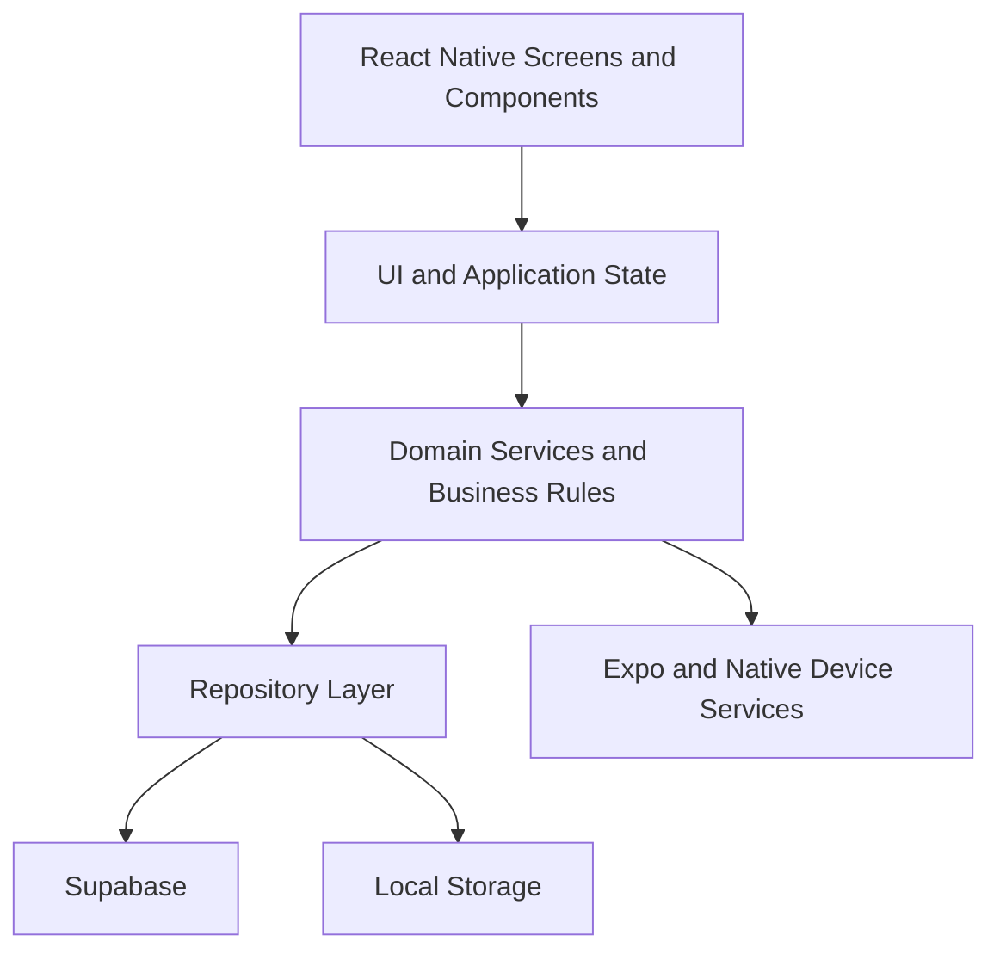

# OnTrack — Technical Architecture (React Native + Expo)

## 1. Official Technology Stack

### Mobile

```text
React Native
Expo
TypeScript
Expo Router
TanStack Query
Zustand
React Hook Form
Zod
```

### Backend

```text
Supabase
├── Authentication
├── PostgreSQL
├── Row Level Security
└── PostgreSQL RPC for transactions
```

### Expo and Device Services

```text
expo-notifications
expo-secure-store
AsyncStorage
React Native AppState
Expo Development Build
EAS Build
```

---

## 2. Why Expo

Expo is used as the React Native framework and development platform.

It provides:

- File-based navigation through Expo Router.
- Android and iOS development from one TypeScript codebase.
- Local and push notification APIs.
- Secure local storage.
- EAS development and release builds.
- Support for custom native libraries through Development Builds.

OnTrack should use an Expo Development Build rather than depend only on Expo Go once native Android behavior is introduced.

---

## 3. Architecture Overview



### Responsibilities

#### Presentation

- Expo Router screens.
- React Native components.
- Forms, dialogs and bottom sheets.
- Loading, error and empty states.

#### Server State

Use TanStack Query for:

- Deadlines.
- Milestones.
- Tasks.
- Sessions.
- User settings.
- Cache invalidation after mutations.

#### Local Application State

Use Zustand for:

- Active focus session.
- Temporary timer state.
- Selected UI filters.
- Unsaved review draft.
- Permission and lifecycle state.

Do not copy all Supabase records into Zustand.

#### Domain

Contains:

- Progress validation.
- Task, milestone and deadline status rules.
- Risk calculation.
- Session lifecycle.
- Follow-up session rules.
- Timer timestamp calculations.

#### Repository

Wraps Supabase and local storage access.

---

## 4. Project Structure

```text
ontrack/
├── app/
│   ├── _layout.tsx
│   ├── index.tsx
│   ├── (auth)/
│   │   ├── _layout.tsx
│   │   ├── login.tsx
│   │   └── register.tsx
│   │
│   ├── (tabs)/
│   │   ├── _layout.tsx
│   │   ├── today.tsx
│   │   ├── plans.tsx
│   │   └── me.tsx
│   │
│   ├── deadline/
│   │   └── [deadlineId].tsx
│   ├── task/
│   │   └── [taskId].tsx
│   ├── session/
│   │   ├── plan.tsx
│   │   └── [sessionId]/
│   │       ├── focus.tsx
│   │       └── review.tsx
│   ├── history.tsx
│   └── settings.tsx
│
├── src/
│   ├── components/
│   ├── features/
│   │   ├── auth/
│   │   ├── deadlines/
│   │   ├── milestones/
│   │   ├── tasks/
│   │   ├── sessions/
│   │   ├── focus/
│   │   ├── risk/
│   │   └── settings/
│   ├── domain/
│   ├── repositories/
│   ├── services/
│   ├── stores/
│   ├── lib/
│   ├── hooks/
│   ├── theme/
│   └── types/
│
├── supabase/
│   ├── migrations/
│   └── seed.sql
├── assets/
├── app.json
├── eas.json
└── package.json
```

---

## 5. Navigation

Use Expo Router.

Bottom tabs:

```text
Today
Plans
Me
```

The following routes do not show the tab bar:

```text
/session/[sessionId]/focus
/session/[sessionId]/review
/session/plan
```

Notification deep links use:

```text
/session/{sessionId}
```

Authentication route protection is handled in the root layout based on the Supabase session.

---

## 6. State Strategy

### TanStack Query

Use for remote data:

```text
useDeadlinesQuery
useDeadlineQuery
useTaskQuery
useTodaySessionsQuery
useSessionHistoryQuery
```

Mutations:

```text
useCreateDeadlineMutation
useCreateTaskMutation
useCreateSessionMutation
useCompleteSessionReviewMutation
```

After review:

```text
invalidate task
invalidate milestone
invalidate deadline
invalidate today sessions
invalidate risk message
```

### Zustand

Suggested active session store:

```ts
type ActiveSessionState = {
  sessionId: string | null;
  taskId: string | null;
  status: 'idle' | 'running' | 'paused' | 'finished';
  startedAt: string | null;
  expectedEndAt: string | null;
  pausedAt: string | null;
  totalPausedMs: number;
  focusMode: 'NORMAL' | 'HIGH' | null;
};
```

Persist only the small active-session snapshot using AsyncStorage.

---

## 7. Forms and Validation

Use:

```text
React Hook Form
+
Zod
```

Validate on both client and database.

Examples:

```text
Deadline due date must be in the future.
Milestone target date cannot exceed Deadline due date.
Session duration must be greater than zero.
progressAfter >= progressBefore.
progressAfter <= 100.
```

---

## 8. Timer Design

The timer source of truth is timestamps, not a decremented counter.

When starting:

```text
startedAt = now
expectedEndAt = now + estimatedDuration
```

Render:

```text
remainingMs = expectedEndAt - Date.now()
```

Pause:

- Save `pausedAt`.
- Stop updating the visible timer.

Resume:

- Calculate pause duration.
- Add it to `expectedEndAt`.
- Reschedule the finish notification.

Use `AppState` to detect foreground and background transitions.

When the app returns:

1. Reload the persisted active Session.
2. Compare local and Supabase state.
3. Calculate remaining time using timestamps.
4. Open Review if the Session has finished.

Do not rely on periodic background execution to count every second.

---

## 9. Notifications

Use `expo-notifications`.

### Session reminder

When creating or rescheduling a Session:

1. Save Session in Supabase.
2. Cancel the previous local notification when needed.
3. Schedule a new notification.
4. Store the notification identifier locally or with the Session.

### Timer completion

When starting:

- Schedule a local notification for `expectedEndAt`.

When pausing:

- Cancel the finish notification.

When resuming:

- Schedule a new finish notification.

When ending early:

- Cancel the notification.

Notification payload:

```json
{
  "type": "SESSION_REMINDER",
  "sessionId": "uuid"
}
```

Tapping it should navigate to the relevant Session.

---

## 10. High Focus

### MVP behavior

High Focus should:

- Explain the purpose of Do Not Disturb.
- Detect whether the necessary permission or configuration is available where possible.
- Provide a button to open Android notification or DND settings.
- Continue the Focus Session even when permission is unavailable.
- Never claim that every notification is blocked.

### Technical limitation

Directly controlling Android Do Not Disturb may require:

- Expo Development Build.
- Native Android configuration.
- A custom native module or compatible native library.

Therefore the safest MVP is:

```text
High Focus
→ Explain DND
→ Open Android settings
→ User enables DND
→ Continue Session
```

Automatic DND control can be a Should Have feature after the core timer works.

---

### Native Access and Development Build

The following Android capabilities may require native access beyond the Expo SDK:

- Check Do Not Disturb / Notification Policy Access.
- Open Android DND settings so the user can grant access.
- Read or change notification policy after the required access has been granted.
- Observe app lifecycle behaviour while the app is backgrounded.
- Use a custom Kotlin native module when an Expo API or compatible library is insufficient.

#### Expo Go limitation

Expo Go contains a fixed native runtime. It is suitable for UI development and basic timer behaviour, but it cannot include a custom Android DND module for OnTrack. Therefore, full High Focus integration cannot be tested in Expo Go.

#### Development Build requirement

An Expo Development Build is a debug version of OnTrack that contains the project's native code. It can include a custom Kotlin DND module, be installed on an Android device or emulator, and be tested much closer to the final application.

```text
Expo Go
→ Fixed native runtime
→ Cannot contain OnTrack's custom Android DND module
→ Cannot fully test High Focus

Development Build
→ Includes OnTrack's custom native code
→ Can include a Kotlin DND module
→ Can test High Focus on a device or emulator
```

Android still requires the user to grant Notification Policy Access in system settings. OnTrack must not silently enable DND or claim that every notification is blocked.

---

## 11. Supabase Integration

Use the official Supabase JavaScript client.

Authentication session storage should use an Expo-compatible storage adapter.

Database:

```text
profiles
deadlines
milestones
tasks
sessions
user_settings
```

RLS ensures each authenticated user accesses only their own hierarchy.

Post-Session Review must call one PostgreSQL RPC:

```text
complete_session_review
```

The transaction updates:

```text
Session
→ Task
→ Milestone
→ Deadline
→ Risk
```

---

## 12. Offline Scope

MVP supports:

- Timer while offline.
- Active-session persistence.
- Local notification.
- Review draft stored locally.
- Retry after network returns.

MVP does not support:

- Full offline CRUD.
- Automatic conflict resolution.
- Multi-device live timer synchronization.

---

## 13. Error Handling

Use typed application errors:

```text
AuthError
ValidationError
PermissionError
NotFoundError
ConflictError
NetworkError
DatabaseError
NotificationError
```

Map them to user-friendly messages.

Do not show raw Supabase errors directly.

---

## 14. Testing

### Unit

Use Jest for:

- Progress rules.
- Status calculation.
- Risk calculation.
- Timer calculations.
- Follow-up Session validation.

### Component

Use React Native Testing Library for:

- Today.
- Plan Session.
- Focus Session.
- Post-Session Review.
- Forms and error states.

### End-to-end

Use Maestro or a comparable mobile E2E tool for the main demo flow.

### Manual Android lifecycle tests

- Background the app during a timer.
- Lock the device.
- Kill and reopen the app.
- Tap a notification.
- Deny notification permission.
- Use High Focus without DND.
- Lose connection while saving review.

---

## 15. Build and Release

Development:

```text
Expo Development Build
```

Build pipeline:

```text
EAS Build
```

Environments:

```text
development
preview
production
```

Environment variables:

```text
EXPO_PUBLIC_SUPABASE_URL
EXPO_PUBLIC_SUPABASE_ANON_KEY
EXPO_PUBLIC_APP_ENV
```

Never place a Supabase service-role key in the mobile app.

---

## 16. Final Stack

```text
React Native + Expo + TypeScript
Expo Router
TanStack Query
Zustand
React Hook Form + Zod
Supabase
expo-notifications
expo-secure-store
AsyncStorage
EAS Build
```

Core data flow:

```text
Plan Session
→ Supabase
→ Schedule Local Notification
→ Start Timestamp-Based Timer
→ Persist Active Snapshot
→ Post-Session Review
→ Supabase RPC Transaction
→ Update Progress and Risk
```
