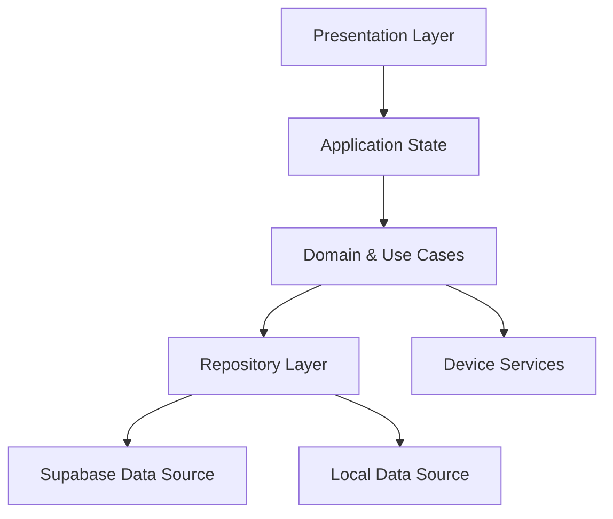
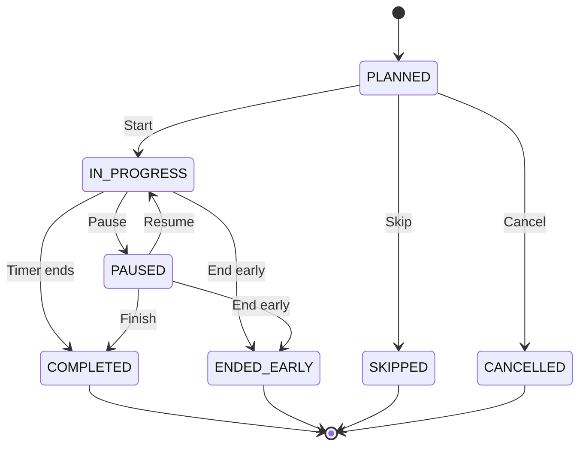
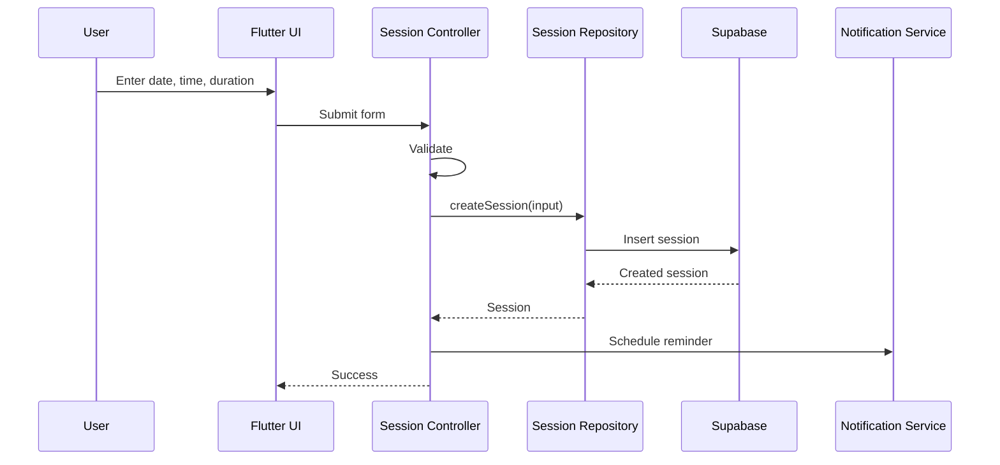
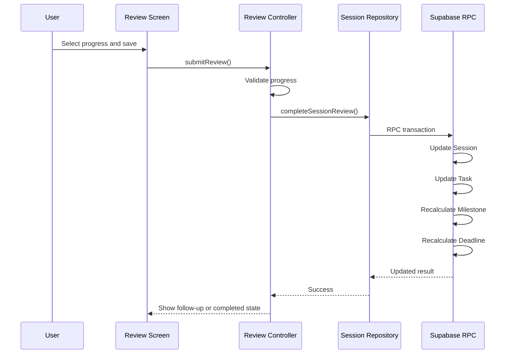

# OnTrack — Technical Architecture

## 1. Mục tiêu

Tài liệu này xác định kiến trúc kỹ thuật cho phiên bản MVP của OnTrack.

Mục tiêu chính:

- Dễ triển khai trong phạm vi đồ án.
- Tách rõ UI, business logic và data access.
- Timer hoạt động ổn định khi app chạy nền.
- Dữ liệu được bảo vệ theo từng người dùng.
- Có thể mở rộng sau MVP mà không phải viết lại toàn bộ.
- Phù hợp với Flutter và Android-first.

---

## 2. Technology Stack

## Mobile App

```text
Flutter
Dart
Riverpod
GoRouter
```

## Backend Platform

```text
Supabase
├── Authentication
├── PostgreSQL
├── Row Level Security
├── Edge Functions hoặc RPC khi cần transaction
└── Realtime optional
```

## Device Services

```text
Local Notifications
Secure Storage
Shared Preferences / Local Database
Android Do Not Disturb integration
App lifecycle handling
```

## Recommended supporting packages

```text
flutter_riverpod
go_router
supabase_flutter
flutter_secure_storage
shared_preferences
flutter_local_notifications
timezone
freezed_annotation
json_annotation
```

Các package cụ thể có thể thay đổi trong quá trình triển khai, nhưng vai trò kiến trúc nên giữ nguyên.

---

## 3. High-Level Architecture



### Layer responsibilities

## Presentation Layer

Chứa:

- Screen.
- Widget.
- Form.
- Dialog.
- Bottom sheet.
- Loading, empty, error state.

Không chứa business rule phức tạp.

## Application State

Chứa:

- Riverpod providers.
- Async state.
- Screen controller.
- Form state.
- Current active Session state.

## Domain Layer

Chứa:

- Entity.
- Business rule.
- Use case.
- Validation.
- Progress calculation.
- Risk calculation.
- Session lifecycle logic.

## Repository Layer

Định nghĩa interface truy cập dữ liệu.

Ví dụ:

```text
DeadlineRepository
TaskRepository
SessionRepository
SettingsRepository
```

## Data Sources

### Remote

- Supabase Auth.
- Supabase PostgreSQL.
- RPC hoặc Edge Function.
- Row Level Security.

### Local

- Active Session snapshot.
- User settings cache.
- Last selected focus mode.
- Notification identifiers.

## Device Services

- Timer.
- Notification scheduling.
- Do Not Disturb.
- App lifecycle.
- Permission handling.

---

## 4. Recommended Project Structure

```text
lib/
├── app/
│   ├── app.dart
│   ├── router.dart
│   ├── theme/
│   └── bootstrap.dart
│
├── core/
│   ├── constants/
│   ├── errors/
│   ├── result/
│   ├── utils/
│   ├── services/
│   └── widgets/
│
├── features/
│   ├── auth/
│   ├── today/
│   ├── plans/
│   ├── deadlines/
│   ├── milestones/
│   ├── tasks/
│   ├── sessions/
│   ├── focus/
│   ├── progress/
│   └── settings/
│
└── main.dart
```

Mỗi feature:

```text
feature_name/
├── data/
│   ├── data_sources/
│   ├── models/
│   └── repositories/
├── domain/
│   ├── entities/
│   ├── repositories/
│   └── use_cases/
└── presentation/
    ├── controllers/
    ├── providers/
    ├── screens/
    └── widgets/
```

Không bắt buộc mọi feature nhỏ đều phải có đủ toàn bộ folder nếu làm MVP. Tuy nhiên nên giữ ranh giới rõ giữa:

```text
presentation
domain
data
```

---

## 5. Navigation Architecture

Bottom navigation:

```text
Today
Plans
Me
```

Dùng Shell Route để giữ trạng thái ba tab.

### Suggested route tree

```text
/
├── splash
├── auth
│   ├── login
│   └── register
│
└── app
    ├── today
    ├── plans
    │   └── deadline/:deadlineId
    │       └── task/:taskId
    └── me
        ├── history
        └── settings
```

Các route không hiển thị bottom navigation:

```text
/focus/:sessionId
/session/:sessionId/review
/session/plan
```

### Deep link

Notification mở:

```text
/session/:sessionId
```

Nếu Session hợp lệ và sắp đến giờ:

```text
Session Detail → Focus Session
```

---

## 6. Main Application State

## Auth State

```text
unknown
authenticated
unauthenticated
```

Splash kiểm tra auth state rồi điều hướng.

## Today State

Chứa:

- Current Session.
- Next Session.
- Later Sessions.
- Completed Sessions.
- One important risk alert.

## Plans State

Chứa:

- Deadline list.
- Selected filter.
- Selected Deadline.
- Expanded Milestones.
- Task details.

## Active Focus State

Đây là state quan trọng nhất.

```text
sessionId
taskId
status
startedAt
expectedEndAt
pausedAt
totalPausedDuration
focusMode
progressBefore
```

Không lưu countdown value làm nguồn sự thật.

Nguồn sự thật:

```text
remainingTime = expectedEndAt - now - pause adjustments
```

---

## 7. Timer Architecture

Timer không nên chỉ giảm một biến mỗi giây.

## Wrong approach

```text
remainingSeconds--
```

Cách này sai khi:

- App chạy nền.
- Thiết bị khóa màn hình.
- App bị pause.
- Frame bị drop.

## Correct approach

Khi Session bắt đầu:

```text
startedAt = now
expectedEndAt = startedAt + estimatedDuration
```

Mỗi lần render:

```text
remaining = expectedEndAt - currentTime
```

Nếu có pause:

```text
remaining
= expectedEndAt
- currentTime
+ totalPausedDuration
```

Hoặc cập nhật lại `expectedEndAt` khi resume.

## Local persistence

Khi Session bắt đầu hoặc thay đổi:

```text
save active session snapshot locally
```

Snapshot:

```json
{
  "sessionId": "...",
  "status": "IN_PROGRESS",
  "startedAt": "...",
  "expectedEndAt": "...",
  "focusMode": "HIGH"
}
```

Khi app mở lại:

1. Đọc snapshot.
2. Đọc Session từ Supabase.
3. So sánh trạng thái.
4. Phục hồi timer.
5. Nếu thời gian đã hết, chuyển sang trạng thái finished.
6. Yêu cầu Post-Session Review.

---

## 8. Session State Machine



Post-Session Review không nhất thiết là Session status riêng.

Có thể lưu thêm:

```text
reviewed_at
```

Hoặc xác định:

```text
progress_after IS NOT NULL
```

---

## 9. Post-Session Transaction

Khi người dùng lưu review:

```text
Input:
sessionId
progressAfter
resultNote
```

Server cần xử lý trong một transaction:

```text
1. Lock Session.
2. Kiểm tra Session thuộc user hiện tại.
3. Kiểm tra Session đã kết thúc.
4. Kiểm tra progressAfter >= progressBefore.
5. Kiểm tra progressAfter <= 100.
6. Update Session.
7. Update Task currentProgress và status.
8. Recalculate Milestone.
9. Recalculate Deadline.
10. Recalculate risk.
11. Commit.
```

Không nên để client thực hiện từng update riêng lẻ.

### Recommended implementation

Supabase PostgreSQL RPC:

```text
complete_session_review(...)
```

Lý do:

- Transaction trong database.
- Giảm số request.
- Không tạo trạng thái cập nhật dở dang.
- Business rule tập trung một nơi.

---

## 10. Repository Interfaces

## DeadlineRepository

```text
getDeadlines()
getDeadlineById(id)
createDeadline(input)
updateDeadline(id, input)
deleteDeadline(id)
```

## MilestoneRepository

```text
createMilestone(input)
updateMilestone(id, input)
deleteMilestone(id)
reorderMilestones(...)
```

## TaskRepository

```text
getTaskById(id)
createTask(input)
updateTask(id, input)
deleteTask(id)
markTaskCompleted(id)
```

## SessionRepository

```text
getTodaySessions()
getSessionsByTask(taskId)
createSession(input)
updateSession(id, input)
startSession(id)
pauseSession(id)
resumeSession(id)
endSessionEarly(id)
completeSessionReview(input)
```

## SettingsRepository

```text
getSettings()
updateNotificationSettings(...)
updateFocusSettings(...)
```

---

## 11. Error Model

Dùng error type rõ ràng:

```text
AuthenticationFailure
PermissionDeniedFailure
ValidationFailure
NotFoundFailure
ConflictFailure
NetworkFailure
DatabaseFailure
NotificationFailure
FocusPermissionFailure
```

UI không hiển thị raw exception.

Ví dụ:

```text
ConflictFailure:
“Session này đã được cập nhật trên thiết bị khác.”

PermissionDeniedFailure:
“OnTrack không có quyền truy cập dữ liệu này.”

FocusPermissionFailure:
“High Focus cần quyền Do Not Disturb.”
```

---

## 12. Offline and Connectivity Strategy

MVP không cần full offline sync.

Hỗ trợ tối thiểu:

- Timer chạy không cần Internet.
- Active Session được lưu local.
- Post-Session Review có thể giữ draft local nếu mất mạng.
- Thông báo local không phụ thuộc backend.
- Khi có mạng lại, người dùng có thể retry lưu review.

Không nên cho phép full CRUD offline trong MVP vì conflict phức tạp.

---

## 13. Notification Architecture

## Session reminder

Khi tạo hoặc reschedule Session:

1. Lưu Session.
2. Schedule local notification.
3. Lưu notification id local.
4. Nếu reschedule, cancel notification cũ.
5. Schedule notification mới.

## Timer finished

Khi Focus Session bắt đầu:

- Schedule notification tại `expectedEndAt`.
- Nếu pause, reschedule.
- Nếu end early, cancel.
- Nếu resume, schedule lại.

## Notification payload

```json
{
  "type": "SESSION_REMINDER",
  "sessionId": "..."
}
```

Khi người dùng bấm:

```text
Open Session Detail hoặc Focus Session
```

---

## 14. High Focus Architecture

High Focus không được mô tả là chặn tuyệt đối toàn bộ thiết bị.

## Flow

```text
User selects High Focus
→ Check DND permission
→ Permission available?
   ├── Yes: enable DND
   └── No: show permission explanation
```

Khi Session kết thúc:

```text
restore previous notification state
```

Cần lưu trước:

```text
previousDndState
```

Nếu native integration quá phức tạp cho MVP:

- Hướng dẫn người dùng bật DND.
- Hiển thị trạng thái permission.
- Timer vẫn hoạt động.
- Không block Session.

---

## 15. Security Architecture

## Authentication

- Supabase Auth.
- Secure token storage.
- Không lưu password trong app database.

## Authorization

- Row Level Security.
- Mỗi query luôn bị giới hạn theo authenticated user.
- Không tin userId gửi từ UI.

## Validation

Validation ở cả hai nơi:

```text
Flutter form validation
+
Database constraints / RPC validation
```

Client validation giúp UX.

Server validation đảm bảo dữ liệu đúng.

---

## 16. Data Flow Example

## Create Session



## Complete Session Review



---

## 17. Testing Strategy

## Unit Tests

- Progress validation.
- Task status calculation.
- Milestone progress calculation.
- Deadline progress calculation.
- Risk calculation.
- Timer remaining-time calculation.
- Follow-up Session validation.

## Widget Tests

- Today screen.
- Plan Session form.
- Focus Session controls.
- Post-Session Review.
- Bottom navigation.
- Empty and error states.

## Integration Tests

Core flow:

```text
Login
→ Create Deadline
→ Add Milestone
→ Add Task
→ Plan Session
→ Start Session
→ Save Review
→ Verify Progress
```

## Manual Android Tests

- App background during timer.
- Lock screen during timer.
- Notification tap.
- DND permission denied.
- End Session early.
- Kill and reopen app.
- Network lost during review.

---

## 18. Deployment Environments

```text
Development
Staging
Production
```

MVP đồ án có thể dùng:

```text
Development
Demo
```

Không dùng chung production database trong quá trình test.

Environment variables:

```text
SUPABASE_URL
SUPABASE_ANON_KEY
APP_ENV
```

Không commit secret key.

---

## 19. Architecture Decisions

### AD-01: Flutter

Lý do:

- Một codebase mobile.
- Phù hợp Android-first.
- UI tùy biến tốt.
- Dễ xây prototype thành app thật.

### AD-02: Riverpod

Lý do:

- State rõ ràng.
- Testable.
- Hợp async state.
- Không phụ thuộc BuildContext cho business logic.

### AD-03: GoRouter

Lý do:

- Nested route.
- Shell navigation.
- Deep link.
- Route guard theo auth.

### AD-04: Supabase

Lý do:

- Auth và PostgreSQL tích hợp.
- RLS.
- Phù hợp đồ án nhỏ.
- Giảm lượng backend code phải tự xây.

### AD-05: PostgreSQL RPC cho Review

Lý do:

- Cần transaction.
- Nhiều bảng cập nhật cùng lúc.
- Giữ business rule tập trung.

### AD-06: Local-first Timer

Lý do:

- Timer phải hoạt động khi offline.
- Không phụ thuộc network latency.
- Backend chỉ lưu trạng thái quan trọng.

---

## 20. Final Architecture

```text
Flutter UI
→ Riverpod Controllers
→ Domain Use Cases
→ Repository Interfaces
→ Supabase + Local Storage
→ Android Device Services
```

Core execution flow:

```text
Plan Session
→ Persist Session
→ Schedule Notification
→ Start Local Timer
→ Persist Active Snapshot
→ Finish Session
→ Review Progress
→ RPC Transaction
→ Update Task
→ Update Milestone
→ Update Deadline
→ Recalculate Risk
```

---

## 21. Next Step

Sau khi Technical Architecture được chốt:

1. Viết Product Backlog.
2. Chia Epic và User Story.
3. Viết Acceptance Criteria.
4. Chia Sprint.
5. Tạo Flutter project structure.
6. Tạo Supabase schema và RPC.
